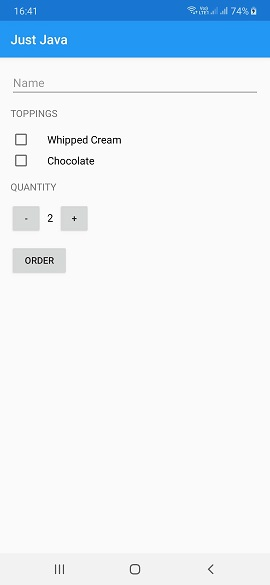
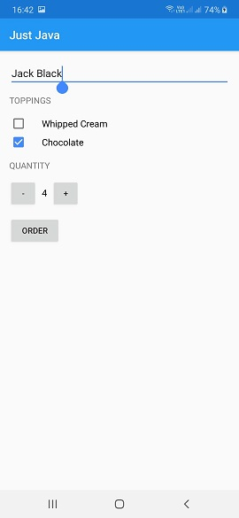
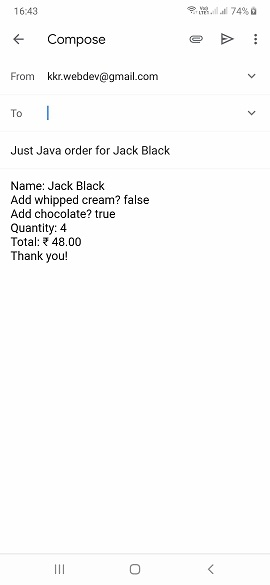

# JustJava

JustJava Android App for <i><a href="https://www.udacity.com/course/android-basics-user-input--ud836" title="Udacity's Android Basics: User Input>Udacity's Android Basics: User Input</a></i> course.
 
Android app that displays an order form for coffee, takes the order, and sends the order as an email.
  
Pre-requisites
--------------
<ul>
<li>Android SDK v22</li>
<li>Android Build Tools v22.0.1</li>
<li>Android Support Repository v22.1.1</li> 
</ul>

Deployment
----------
This app uses the Gradle build system. To build this project, use the "gradlew build" command or use "Import Project" in Android Studio.
 
 Screenshots
 -----------

